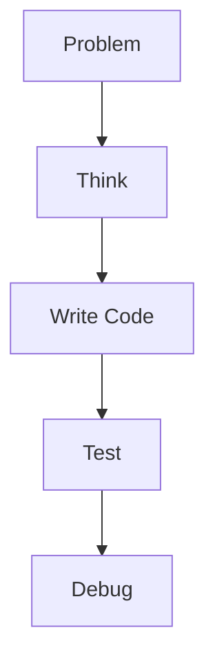
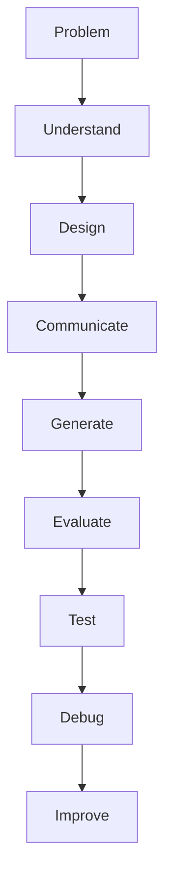
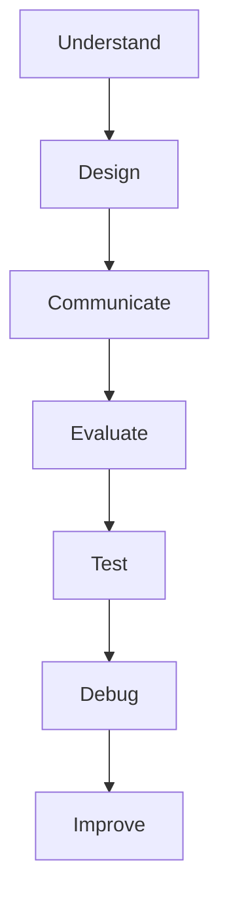

# What Am I Learning in AI-Assisted Coding?

If AI is generating most—or even all—of my code, what am I actually learning?

That is an important question.

If you simply ask AI to build an application, copy the code, and submit it without understanding what it does, then you probably aren't learning much about web development. You may be learning how to prompt an AI, but you aren't necessarily learning how to develop software.

But that's not the goal of AI-assisted coding.

Think of AI as a very fast pair programmer or junior developer. It can write code for you, but **you are responsible for understanding, evaluating, testing, debugging, modifying, and integrating that code.**

The important question is therefore not:

> "How much code did I write myself?"

It is:

> **"How much of the application do I understand, and what can I do with that understanding?"**

## What Are You Learning?

When you use AI to build a web application, you should be developing the ability to:

- Understand how a web application is structured.
- Break a problem into smaller components.
- Decide what the application should do before asking AI to implement it.
- Communicate technical requirements clearly.
- Read and understand code generated by AI.
- Recognize when AI-generated code is incorrect or inappropriate.
- Debug problems rather than simply asking AI to fix them.
- Test whether an application actually behaves as expected.
- Modify and extend an existing application.
- Make architectural and technology decisions.
- Think about security, privacy, accessibility, performance, and maintainability.
- Explain why the application works the way it does.

## AI Changes What It Means to Program

Traditionally, programming could be thought of as:

AI-assisted development increasingly looks more like:

The act of typing every line of code is becoming less important.

The ability to **reason about software** is becoming more important.

AI can generate a solution very quickly. But it cannot transfer understanding to you simply by generating that solution.

## The "90% of the Code" Test

Suppose AI generates 90% of your application.

There are two very different situations:

### Situation 1

> AI wrote 90% of the code, and I understand 0% of it.

You haven't really learned web development.

You have produced an application, but you don't possess the knowledge necessary to maintain, debug, evaluate, or extend it.

### Situation 2

> AI wrote 90% of the code, but I understand what it does, why it was designed that way, how the pieces interact, how to test it, how to debug it, and how to change it.

That's a very different outcome.

You may have learned **more about software development than if you had manually typed every line**, because you spent your effort thinking about the system rather than mechanically entering syntax.

## The Skill That Matters Most

The most important skill in AI-assisted programming may be this:

> **Can you tell when the AI is wrong?**

AI can confidently produce code that:

- Doesn't work.
- Doesn't satisfy the requirements.
- Contains security vulnerabilities.
- Uses an inappropriate architecture.
- Has subtle bugs.
- Is unnecessarily complicated.
- Doesn't scale.
- Doesn't handle edge cases.
- Looks reasonable but doesn't actually do what you think it does.

If you don't understand programming concepts, you may not recognize these problems.

That is why learning the fundamentals still matters.

## Your Responsibility

When AI generates code for you, you are still the developer.

You should be able to answer questions such as:

- What does this code do?
- Why does it work?
- What assumptions does it make?
- What happens if something goes wrong?
- How does data move through the application?
- Where is the data stored?
- How does the browser communicate with the server?
- What happens when a user submits this form?
- Why did you choose this approach?
- How would you change this feature?
- How would you test this?
- What security risks exist?
- What would happen if the application had 10,000 users instead of 10?

If you cannot answer these questions, then the AI may be doing your learning for you.

## AI Should Make You More Capable, Not More Dependent

The goal of this class is not to prevent you from using AI.

Quite the opposite.

I want you to learn how to use AI **well**.

A professional developer will increasingly work with AI systems. Knowing how to collaborate with these systems is therefore a valuable technical skill.

But there is an important difference between:

> **Using AI to amplify your abilities**

and

> **Using AI because you don't have the ability to do the work yourself.**

The first makes you more capable.

The second makes you dependent.

## So, What Am I Actually Learning?

You are learning how to **think like a software developer in a world where code generation is cheap**.

You are learning how to:

AI may write the code.

**You are responsible for the software.**

And ultimately, that's what you are learning.
